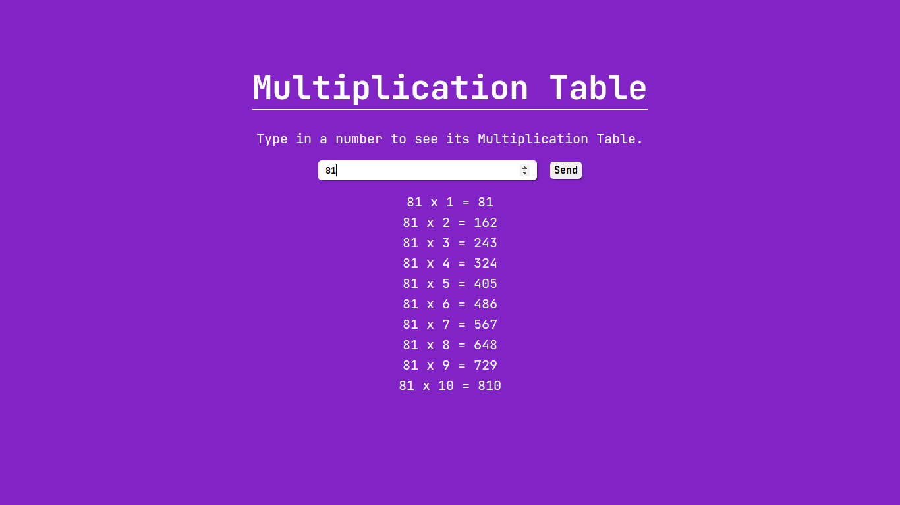

<p align="center">
  <h3 align="center">Math Multiplication Table</h3>

  <p align="center">
    A simple website that shows the multiplication table of a given number.
    <br />
    <a href="https://github.com/LucFerSan/math-multiplication-table.git"><strong>Explore the docs »</strong></a>
    <br />
    <br />
    ·
    <a href="https://github.com/LucFerSan/math-multiplication-table.git/issues">Report Bug</a>
    ·
    <a href="https://github.com/LucFerSan/math-multiplication-table.git/issues">Request Feature</a>
  </p>
</p>

## About The Project



A simple website that shows the multiplication table of a given number, made with simple html, css and vanilla javascript.

### Built With

- [Html](https://developer.mozilla.org/pt-BR/docs/Web/HTML)
- [Css](https://developer.mozilla.org/pt-BR/docs/Web/CSS)
- [Javascript](https://developer.mozilla.org/pt-BR/docs/Web/JavaScript)

### Installation

1. Clone the repo
   ```sh
   git clone https://github.com/LucFerSan/math-multiplication-table.git.git
   ```

## Contributing

Contributions are what make the open source community such an amazing place to be learn, inspire, and create. Any contributions you make are **greatly appreciated**.

1. Fork the Project
2. Create your Feature Branch (`git checkout -b feature/AmazingFeature`)
3. Commit your Changes (`git commit -m 'Add some AmazingFeature'`)
4. Push to the Branch (`git push origin feature/AmazingFeature`)
5. Open a Pull Request

## License

Distributed under the MIT License. See `LICENSE` for more information.

## Contact

Lucas Fernandes - fernandes.lucas11@outlook.com

Project Link: [https://github.com/LucFerSan/math-multiplication-table.git](https://github.com/LucFerSan/math-multiplication-table.git)
